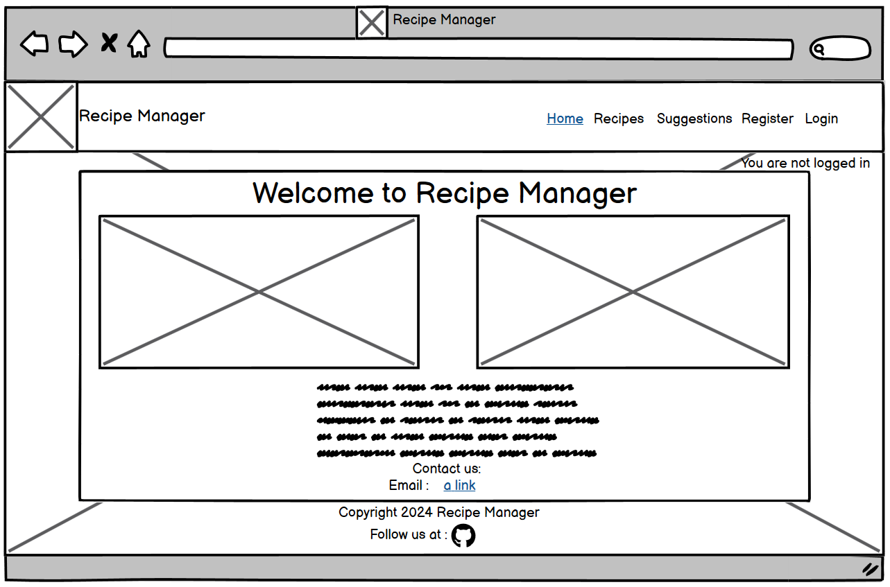
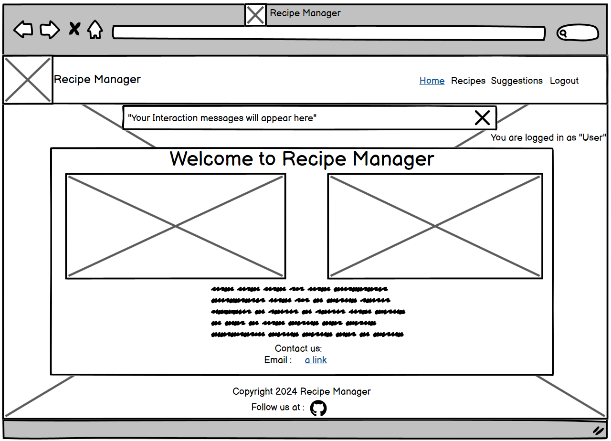
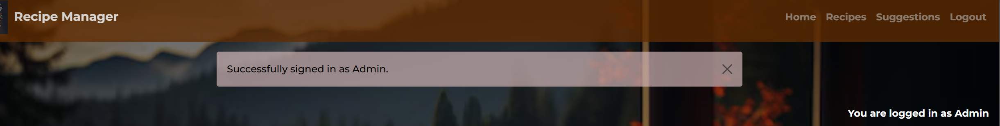

#  **Recipe Manager**

### A recipe management and discovery website
Recipe Manager is an innovative online platform that combines the functionality of a social media site with the practicality of a recipe-sharing hub. Designed for food enthusiasts of all kinds, from home cooks to professional chefs, Recipe Manager strives to bring people together by fostering a shared passion for cooking, eating, and culinary discovery.

Live site: <a href="https://recipe-manager-site-9b7bfd4b2c5e.herokuapp.com/" target="_blank">Recipe Manager</a>

## Table of Contents
1. [UX - User Experience](#ux---user-experience)
    - [Overview](#overview)
    - [Design Inspiration](#design-inspiration)
    - [Target User](#target-user)
2. [Project Planning](#project-planning)
    - [Site Goals](#site-goals)
    - [Color Scheme](#color-scheme)
    - [Fonts](#fonts)
    - [Agile Methodologies](#agile-methodologies)
    - [Sprints](#sprints)
3. [User Stories](#user-stories)
    - [User Stories Overview](#user-stories-overview)
    - [List of User Stories](#list-of-user-stories)
4. [wireframes](#wireframes)
5. [Database Planning](#database-planning)
    - [ER Diagram](#er-diagram)
6. [Features](#features)
    - [Home Page](#home-page)
    - [Recipes Page](#recipes-page)
    - [Suggestions Page](#suggestions-page)
    - [Registration Page](#registration-page)
    - [Log In Page](#log-in-page)
    - [Log Out Page](#log-out-page)
    - [Nav Bar And Footer](#nav-bar-and-footer)
    - [Confirmation Messages](#confirmation-messages)
    - [CRUD Functionality](#crud-functionality)
7. [Future Features](#future-features)
    - [User Page](#user-page)
8. [Technologies Used](#technologies-used)
9. [Testing](#testing)
    - [Accessability testing](#accessability-testing)
    - [HTML Validation](#html-validation)
    - [CSS Validation](#css-validation)
    - [Javascript Validation](#javascript-validation)
    - [Python Validation](#python-validation)
    - [Automated Testing](#automated-testing)
    - [Manual Testing](#manual-testing)
10. [Deployment](#deployment)
11. [Resources](#resources)
12. [Credits](#credits)
13. [Acknowledgements](#acknowledgements)
14. [Updates](#updates)

## UX - User Experience

### Overview

The Recipe Manager website is designed to help people discover new ways of cooking and finding new foods. The aim of the site is to be simple and easy to navigate while allowing the user to like and save foods that they find while on the site. It was also made with the possibility in mind of bringing out hidden family recipes that people may want to share with the world.

### Design Inspiration

The inspiration for the design of this website came from the idea of having a food social site where you scroll and save the items you think you may enjoy. There will be a chance to also have this as a social too with future updates, but the main purpose of the site is to be able to find recipes you might not have come across before.

### Target User

- **Experienced Cooks**: Cooks with experience that could add recipe ideas to the site, who could also give tips to other recipes on the site.
- **Cooks With No Experience**: Cooks with no experience looking to learn how to cook dishes but unsure where to start. The site will have a social aspect to it where others can offer advice or help with instructions to cooking items.
- **Cooks Looking To Discover New Recipes**: Cooks who just want to scroll through recipes while they have some downtime in the hopes they could find inspiration for new dishes.
- **Cooks Looking To Share Recipes**:Cook enthusiasts who want to give people the best options of food they can.

##### [ Back To Table Of Contents ](#table-of-contents)

## Project Planning

### site goals
The goals of the website is to bring people together who can share recipes and want to teach or learn how to cook dishes. There will be a user page where the user can keep recipes they like stored. 

### Color Scheme
Before starting the project i had some color schemes in my head ready to use. The use of darker background colors such as black and grey, with a strong orange color for borders really makes the content stand out for me. Mixed with images i find the colors i've used for the website are not too bright and not too dark.

### Fonts
For the fonts i have used sans seriff to keep the page layout simple. This may be subject to change in future updates.

### Agile Methodologies
In developing my Recipe Manager web app, I adopted Agile methodology to ensure flexibility, continuous improvement, and efficient project management. The use of Agile allowed for iterative development, enabling me to frequently reassess and adjust the project scope.

#### Kanban Board Overview
The project board was created to help develop the project down specific paths to meet all needed criteria. This approach was crucial in helping to plan what section would be tackled next and it is a very good approach if there are multiple people working towards a project goal.

### Sprints
In the first sprint the goal was to get the MVP(Minimal Viable Product) in place. This was achieved but had a few known issues.
The second sprint has been to include more features to meet a better standard user experience. A lot of the second sprint was adding files to the readme.MD.

##### [ Back To Table Of Contents ](#table-of-contents)

## User Stories

### User Stories Overview
The user stories has been a great way to plan out a project. Getting all the idea's ready then seeing if they are possible to create really helps to drive th project towards it's goal.

### List of User Stories
Here there will be links to my user stories for each subject. The user stories were created to try and get the site to meet certain criteria to a high standard.

**Registration**
- [User Registration](https://github.com/liam-2112/recipe-site/issues/2)
- [User Login](https://github.com/liam-2112/recipe-site/issues/3)
- [User Logout](https://github.com/liam-2112/recipe-site/issues/5)

**Features**
- [Home Page](https://github.com/liam-2112/recipe-site/issues/1)
- [Recipes List](https://github.com/liam-2112/recipe-site/issues/7)

**Admin**
- [Quality Control](https://github.com/liam-2112/recipe-site/issues/6)
- [Dashboard](https://github.com/liam-2112/recipe-site/issues/12)

**User**
- [Confirmation Feedback](https://github.com/liam-2112/recipe-site/issues/11)
- [Recipe Information](https://github.com/liam-2112/recipe-site/issues/10)
- [Choose A Recipe For Me](https://github.com/liam-2112/recipe-site/issues/4)
- [Save Recipes](https://github.com/liam-2112/recipe-site/issues/9)
- [Upvote Recipes](https://github.com/liam-2112/recipe-site/issues/8)

##### [ Back To Table Of Contents ](#table-of-contents)

## Wireframes

Balsamiq Wireframes was used to create a base idea for the website. The idea's that have been drawn up only act as a guide to what the site should look like. the site may look different once it has been developed and a better layout could be taken into consideration.

### Large Screens
### Home Page
The idea behind the home screen is to give the user a welcome message with a couple of pictures to look at. There will be a nav bar with clear indications to other pages and a message in the top right telling you if you are signed in or not. the footer will contain a link to the github repository. There will also be a link to email the site owner directly.

### Recipes Page
The recipes page will be layed out to display the image of the dish to the left, with a title and a breif description of the food. there will be catgories which you will be able to scroll through and there will be pagination to keep the quality of the page reasonable.

### Suggestions Page
This will be where users who have signed up and have logged in will be able to leave a suggestion to help push the site into a direction. It acts as a way for the user to request features that they might want on the site. The suggestions will be displayed into cards and there will be pagination for quality control.

### Suggestions - Logged In Page
This will be the same as the suggestions page with the only difference being that the user can create a suggestion and submit it.

### Sign Up Page
The sign up page will have a link for users already signed up to click on. there will be multiple fields to fill out with strong protection on password security. If anything is missed during this step by step process there will be required field indicators.

### Login Page
The Sign In page will have a username and a password option for users to log in. There will also be an optional remember me button. If the user hasn't registered then there will be a link for the user to follow to be able to sign.

### Logout Page
The Sign Out page will have a button to confirm that you wish to log out.

### Confirmation Messages
I will set the confirmation messages to always appear in the same place at the top middle section of the screen. These will confirm when you log in or out and when you make any changes on the site.

### Mobile
### Home Page
The mobile version will shrink down to mobile size with responsiveness and the navbar will collapse into a dropdown box

### Recipe Page
This will work the same as the full version but everything will be sized to fit mobile screen. The buttons may change for quality control and less screen clutter.

### Suggestions Page
This page will change the card positionings to sit on top of each other rather than side by side to allow the user a better experience when browsing the site.

### Sign Up Page
The sign up page be made to fit a smaller screen and be responsive with mobile.

### Login Page
The sign in page will be made to fit a mobile screen using responsive design with not much change

### Logout Page
The logout page will be made to fit a mobile screen with responsive design.

### Navigation Bar
The naigation bar will be made into a little dropdown box option in the top right. This will save screen clutter and give the user a better quality when browsing. The links to other pages will be within the dropdown.

##### [ Back To Table Of Contents ](#table-of-contents)

## Database Planning

### ER Diagram
As part of the planning I have made an ER diagram to show how the database would be connected for the project. I have done this on paper but plan to transfer this into a diagram planner in a future update to allow the diagram to be clearer.

#### ER Diagram

##### [ Back To Table Of Contents ](#table-of-contents)

## Features

### Home Page
#### Home
This is the Home page of the finished website. It displays 2 images with a welcome message. There is clear navigation and logged in status. The page gives a small paragraph about what the site offers.

#### Mobile Home
When the home page has been brought down to mobile screen size i had originally planned to have the 2 images shrink. Ultimately i decided having 1 picture take over the spot was a better user experience design choice.

### Recipes Page
#### Recipes
The recipes pages was the biggest change i made from my planning. Initially my design idea was to have the pictures to the left with the title and description on the right. I decided to change the idea to be within cards that show a picture a title and very brief description. Once a card is selected it will take you to a page with the full details of the recipe and how to make it with instructions and ingredients. The reason for doing it this way was for a better quality choice and allowing the users to navigate the pages with a better experience. The pages are paginated and the users can add their own recipe. The lastest recipes will be show first.

#### Mobile Recipes
When the page loaded onto a mobile view the cards align on top of each other to allow a better navigation for the user.

#### Recipes detail
The details page will be loaded when a card is selected, This will give the user the full scrope of the item and allow the user to follow clearer instructions. In a future update there will be a button within this page for users to save the recipe to their own user page.

### Suggestions Page
#### Suggestions
Here the users can leave a suggestion with full CRUD functionality. This is a way for the users to request functions to be built in allowing them to have a better experience with the website.

#### Suggestions Logged In
This will be the form to leave a suggestion on the site.

#### Mobile Suggestions
The page will put stack the cards on top of each other allowing the using to scroll through the page with a better experience.

#### Mobile Suggestions Logged In
This will be the same as on large screens but made to fit a mobile screen.

### Registration Page
#### Sign Up
On the sign up page there will be a link at the top to redirect existing users to log in. This page will prompt you to fill out any blank spaces you could miss. The passwords are secure and will prompt you not to use a generic password if you try to. A required field will pop up if you try to click sign up and have missed a field.

#### Mobile Sign Up
This will act the same but optimised for mobile screens.

### Log In Page
#### Log In
This will be the log in page. It will allow existing users to sign in with the correct details.

#### Mobile Log In
This will act the same as the sign in but optimised for mobile screens.

### Log Out Page
#### Log Out
This page will bring up a message asking if you are sure you want to log out. There is a button to confirm the log out of your account.

#### Mobile Log Out
Works the same as the desktop version but optimised to fit mobile.

### Nav Bar And Footer
#### Navigation Bar
Here there is the site logo and name to the left, which when clicked on takes you to the home page. To the right is the page navigation tabs which will take you to the selected page.

#### Footer
The copyright and github link are in the footer. Upon clicking the logo it will change color and take you to the github repo.

#### Mobile Navigation Bar
On mobile the navigation bar will be moved into a dropdown box. This was to give the user visual area upon loading the site. the dropdown box can be clicked again to become a box in the top right again.

### Confirmation Messages
#### Log In Confirm
Confirming messages will all appear in the middle top of the screen to keep the page consistant and so that the user knows where the message should appear.

#### Delete Suggestion Confirm
The delete suggestion will come up as a warning at the top of the screen. This is to make sure that the user is aware the deleted item cannot be recovered.

#### Delete Recipe Confirm
Again this message is to make the user aware they have clicked on the delete button. It gives the user the chance to back out and not delete the selected item.

#### Sign Out Confirmation
Confirming messages will all appear in the middle top of the screen to keep the page consistant and so that the user knows where the message should appear.

#### Suggestion Submission
Confirming messages will all appear in the middle top of the screen to keep the page consistant and so that the user knows where the message should appear.

#### Suggestion Update
Confirming messages will all appear in the middle top of the screen to keep the page consistant and so that the user knows where the message should appear.

#### Required Fields
This Shows the required area to be filled out. It's quality control so that the user is made aware that something has been missed.

### CRUD functionality
#### Edit And Delete Suggestions
It is important that a user can Create, Edit, Update and Delete anything they on the site. This gives the user the full control they need over their items on the site.

#### Update Suggestion
Full control over their items on the website makes for a better user experience.

#### Add New Recipe
Full control over their items on the website makes for a better user experience.

#### Edit Recipe Top
Full control over their items on the website makes for a better user experience.

#### Edit Recipe Bottom
Full control over their items on the website makes for a better user experience.

#### Recipe Edit And Delete
Full control over their items on the website makes for a better user experience.

##### [ Back To Table Of Contents ](#table-of-contents)

## Future Features

### User Page
In a future update to the website I plan to add a page where the logged in user can save the recipes that they like from the recipes pages.

### Randomiser
I plan to make a button that links to the user Page that allows the device to randomly pick an item from the saved recipes. This will be a fun extra addition to the site to help people decide what food to eat for the day.

### Recipe Comments
In a future update there will be comments implemented to each users recipes. I will be making sure that the comments are authorised before appearing to stop any harmful messaging and to maintain quality control.

##### [ Back To Table Of Contents ](#table-of-contents)

## Technologies Used
| Technology | Reason |
| --- | --- |
| HTML | Page Structure
| Javascript | Event Listeners, Modals
| CSS | Page Styling
| Bootstrap 5 | Page Styling
| Python | Backend Server
| Django | Backend Framework
| CodeInstitute PostgreSQL | Database
| Balsamiq Wireframes | Design
| Git | Version Control
| GitHub | Code Hosting and Project Management
| Heroku | Project Deployment
| GitPod | IDE
| VSCode | Backup IDE

##### [ Back To Table Of Contents ](#table-of-contents)

## Testing

### Accessibility Testing

https://lighthouse-metrics.com/
For the accessibility testing i used a global lighthouse website. The scores had very slight improvments to be made but the majority of the web page came back with great results.

#### Lighthouse Test 1

#### Lighthouse Test 2

### HTML Validation
https://validator.w3.org/#validate_by_input
For the HTML validator the only errors that got picked out are where the file are being loaded from another source, so it believes that they are missing. This causes no issues to the page or code itself as everything loads and works as intended. 

#### HTML Test 1

#### HTML Test 2

### CSS Validation
https://jigsaw.w3.org/css-validator/#validate_by_input
Using Jigsaw to validate my css, i did a full check and there was no errors within the css. Most of the css code is commented to what it does / targets where a description may be needed for developers reading the CSS.

#### CSS Test 

### JavaScript Validation
https://codebeautify.org/jsvalidate
While testing the JavaScript there was a few errors. The javascript works and there no major issues however the validators picked up on some code i had entered that is currently being implemented into a new feature. Once taken out the error codes were small fixes such as spacing. I have left the star rating system javascript in the code as it is currently being worked on.

#### JavaScript Test

### Python Validation
For the python Validation i used the Code institute python checker. I went through every file idividually checking for errors to only come across a few amount which was targetted at lines being slightly too long. The rest of the code came through great and no issues were found while testing.

#### Python Test 1

#### Python Test 2

#### Python Test 3

### Manual Testing
While automated testing is highly effective at identifying bugs, certain issues—such as slight visual inconsistencies on the frontend or unexpectedly missing buttons—can be challenging to detect. Verifying that the frontend appears as intended is particularly difficult because it’s hard to define precise criteria for automated tests. To address this, manual testing was also conducted, focusing on user stories to simulate real-world interactions. Additionally, a few smaller tests were written in user story format to maintain consistency.

| **User Stories** |  Tested |  Works As Intended |
|  --- | --- | --- |
| As an **admin**, I can **Enter the database to approve comments and suggestions** | ✅ | ✅
| As an **admin** I can **Delete other peoples recipes or suggestions** |✅ | ✅
| As an **admin** I can **Use the CRUD functionality to it's full potential** |✅ | ✅
| As an **admin** I can **See the approval messages that are awaiting pending on the website pages** |✅ | ✅
| As an **unregistered user** I cannot **Access other peoples recipes to edit or delete** |✅ | ✅
| As an **unregistered user** I cannot **gain access to the admin panel** |✅ | ✅
| As an **unregistered user** I can **scroll through the recipes and enjoy browsing the page** |✅ | ✅
| As a **unregistered user**, I can **Read the details of the recipes** |✅ | ✅
| As a **unregistered user**, I cannot **Log into the site without first signing up** |✅ | ✅
| As a **unregistered user**, I can **use the register page to create an account** |✅ | ✅
| As a **user**, I can **log in using my details** |✅ | ✅
| As a **user**, I can **leave a recipes on the recipes page** |✅ | ✅
| As a **user**, I can **edit delete and update the recipe** |✅ | ✅
| As a **user**, I can **leave a suggestion** |✅ | ✅
| As a **user**, I can **edit delete and update suggestions** |✅ | ✅
| As a **user**, I can **see confirmation messages whenever i change a suggestion or recipes** |✅ | ✅
| As a **user**, I can **see where required fields need to be filled out** |✅ | ✅

##### [ Back To Table Of Contents ](#table-of-contents)

## Deployment

### Heroku Deployment
Deployment with Heroku
This project was deployed to Heroku, which integrates well with GitHub for continuous deployment. The deployment steps can be followed as below:

1. Create a database in Code Institute CI.(If you are not a CI student, use another means to set up a Django compatible database)
2. Clone the repository.
3. Create an env.py file with the following file contents.

import os
os.environ.setdefault("DATABASE_URL", "<YOUR DATABASE URL>")
os.environ.setdefault("SECRET_KEY", "<GENERATED SECRET KEY>")
os.environ.setdefault("CLOUDINARY_URL", "<YOUR CLOUDINARY URL>")

env.py file contains sensitive information. Make sure not to push it.

4. Run pip3 install -r requirements.txt to install the dependencies.
5. Run python3 manage.py migrate to initialise your database.
6. Run python3 manage.py createsuperuser to create a superuser.
7. Login to Heroku and create a new deployment.
8. Connect the Heroku app to your GitHub repo
9. Create the following configuration variables (DO NOT CREATE DEBUG.):
DATABASE_URL
SECRET_KEY
10. Click the "Deploy" button to deploy the app

#### Heroku Build Process

##### [ Back To Table Of Contents ](#table-of-contents)

## Resources
* [Stack Overflow](https://stackoverflow.com/)
* [W3School](https://www.w3schools.com/)
* [YouTube](https://www.youtube.com/)
* [Django docs](https://www.djangoproject.com/)
* [Crispyforms docs](https://django-crispy-forms.readthedocs.io/en/latest/)
* [Chat Gpt](https://chatgpt.com/)

##### [ Back To Table Of Contents ](#table-of-contents)

## Credits
I give credit to https://github.com/Anka-S/hata-na-tata. I was inspired by their work and the layout was very similar to what i wanted to use myself.
I have used their code as a template and changed bits to meet what i need. Some bits of code are still the same, But with future updates i plan to change the code to fit better with my project and the features.

I have seen a good table style used in https://github.com/CrazyEggz/ci-fridge-pal/tree/main projects readme.MD. I have Implemented this into my readme so i give credit to this project for the table styling.

I give credit to Code Institute for helping me through this journey and for giving me code i have used from the LMS Django walkthrough. Thank you to all the facilitators for being there to help too.

I must also credit Mars Oakley and Guy Steele-Perkins from my WECA Boootcamp program for helping me to understand some issues such as merging.

##### [ Back To Table Of Contents ](#table-of-contents)

## Acknoweledgement
Ran out of time to do/finish the README.MD
future updates to come to the website and the readme.
All Images were generated by AI with Chat gpt or taken and uploaded by myself.

I have gained feedback on my submission and decided to implement some of the features mentioned. Check the updates Section of the readme.md.

##### [ Back To Table Of Contents ](#table-of-contents)

## Updates

**sprint 2**
I have updated the website to display the recipes in a new way. The reason for this choice was because there were errors and bugs around the accordian style i had previously set up. It is now set to a card system where if you click the card it takes you to a page with more information on the recipe. The page now has pagination so it will display a set amount of recipes per page allowing for a better user experience. The Users now may also upload their own recipes to the site.

##### [ Back To Table Of Contents ](#table-of-contents)